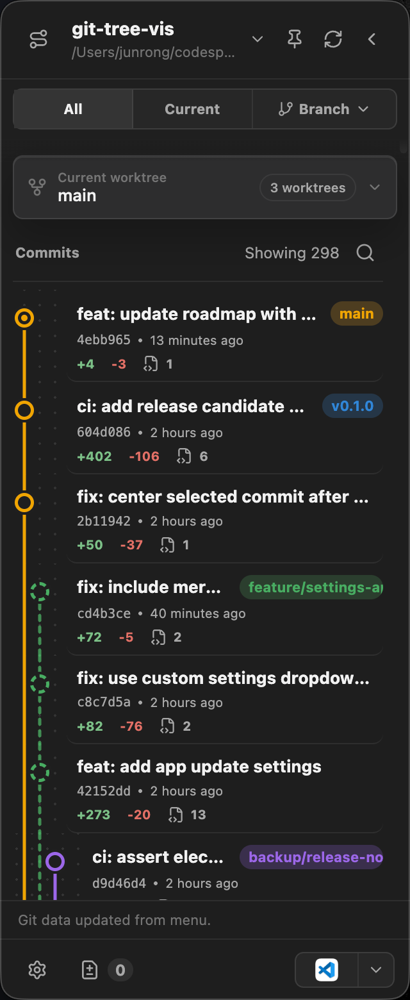

# Gocus

Gocus is a compact desktop Git companion that sits beside your editor and keeps the current repository, branch,
worktrees, changed files, and recent commits visible without opening a full Git client.

It is designed for quick orientation: check what changed, search recent history, jump into another app, or start a
safe branch, checkout, or merge action from the side panel.

GitHub repository: [jarvisluk/gocus](https://github.com/jarvisluk/gocus)

The screenshot below shows Gocus at its normal floating-panel size.



## What Gocus Helps With

- See the active repository, folder path, and current branch at a glance.
- Switch between all commits, the current branch, or a selected branch view.
- Search commits by title, message, hash, author, branch, parent, or worktree text.
- Keep linked worktrees visible, including cleanup hints for worktrees that are safe to remove.
- Review changed files and open the repository or selected files in your preferred app.
- Start branch, checkout, and merge actions from commit rows with confirmation before Git changes are made.
- Tune appearance, refresh behavior, launch settings, update behavior, and external app shortcuts.

## Get Started

1. Download the macOS or Windows build from [GitHub Releases](https://github.com/jarvisluk/gocus/releases).
2. On macOS, unzip the app and move **Gocus.app** into `/Applications`.
3. On Windows, download **Gocus-...-win-... .zip**, extract it, and run **Gocus.exe** from the extracted folder.
4. Click **Open folder** and choose a local Git repository.
5. Pin the floating panel if you want it to stay above your editor.

If macOS blocks the app on first launch, open it from Finder with **Control-click -> Open** so Gatekeeper can confirm the app.
If Windows SmartScreen warns on an unsigned Windows build, choose **More info** and run it only if you trust the source.

## Read The Panel

The header shows the selected repository, path, current branch, pin state, refresh action, and collapse button.

The view selector controls which commits are shown:

- **All** shows the full local history returned by the app.
- **Current** focuses on the currently checked-out branch.
- **Branch** lets you choose a specific branch from the branch menu.

The worktree card shows the current worktree first. Open the worktree menu to inspect linked worktrees and cleanup
status. Worktrees that are already merged, patch-equivalent, or prunable are marked as safe cleanup candidates.

## Work With Commits

Use the commit list as a compact timeline:

- Click a commit to select it and reveal available actions.
- Use the search button beside the commit count to filter history.
- Press **Enter** in search to select the first matching commit.
- Press **Escape** to close search or return from nested settings pages.
- Use commit row actions to create a branch, check out a commit or ref, or merge into the selected target branch.

Gocus opens confirmation dialogs for Git-changing actions. It also keeps merge behavior explicit, so you can choose
whether merges should create merge commits in Settings.

## Review Current Changes

The footer changed-files button shows how many files changed right now. Open it to inspect the changed-file list, then
open the repository or a file in an enabled external app such as VS Code, Explorer/Finder, Terminal, Cursor, or Xcode.

Use the external-app picker in the footer to choose the default target for workspace actions.

## Settings

Open Settings from the footer gear.

Settings are organized by task:

- **App** controls automatic update checks and automatic update installation.
- **Appearance** controls theme mode, light/dark presets, density, and font.
- **Graph** controls commit graph line style.
- **Behavior** controls auto refresh, launch at login, tray/menu bar icon, no-fast-forward merge behavior, and prompt language.
- **Workspace** controls which external apps appear in open-in menus.

## Tips

- Keep Gocus pinned while working through a branch or review.
- Use **Refresh Git status** after running Git commands outside the app.
- Use worktree cleanup labels as a review aid before removing old worktrees.
- If a branch action is unavailable, check whether that branch is already checked out in another worktree.

## Run From Source

For local development:

```bash
npm install
npm run dev
```

Run the local quality gate before handing off changes:

```bash
npm run verify
```

This runs dependency audit, secret scan, lint, unit checks, UI smoke checks, and the production build.

Build the web bundle:

```bash
npm run build
```

Package a local macOS build:

```bash
npm run package:mac
```

Package a local Windows portable build from Windows:

```bash
npm run package:win
```

Package the full Windows installer/update set from Windows for internal candidate builds:

```bash
npm run package:win:release
```

Release details live in [docs/release.md](docs/release.md).
